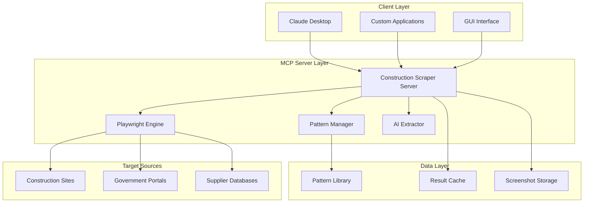
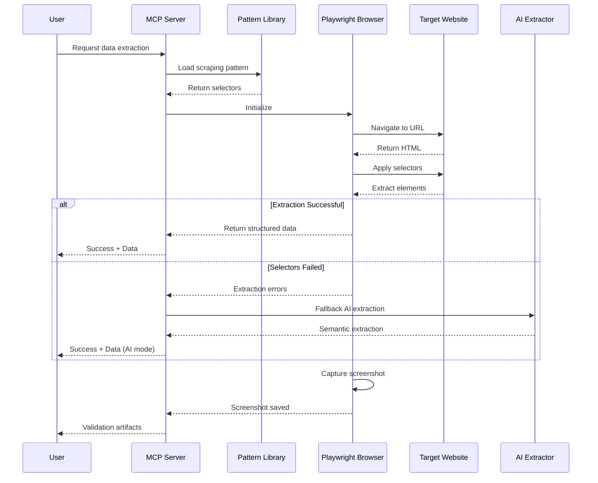
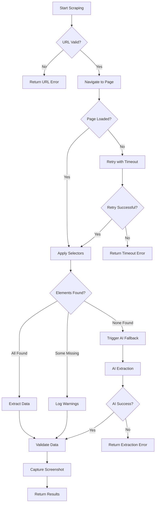
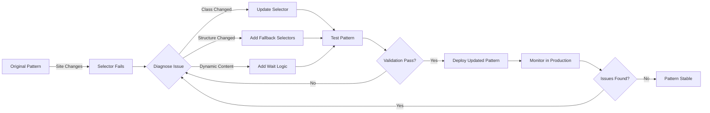
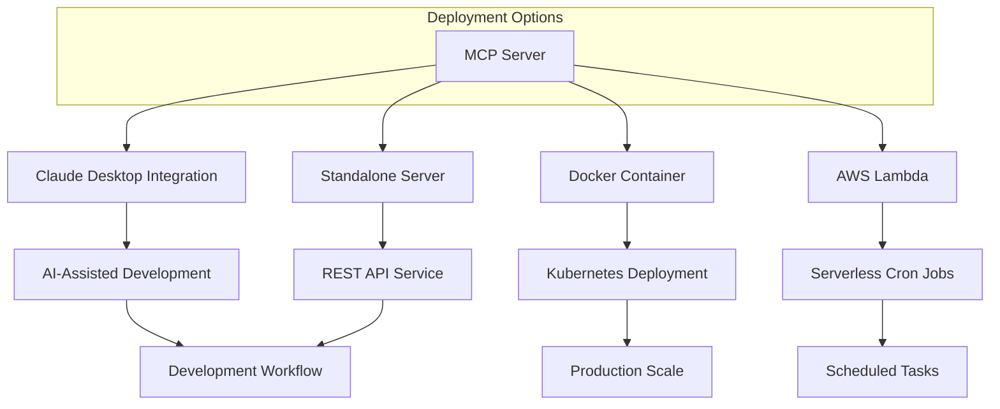
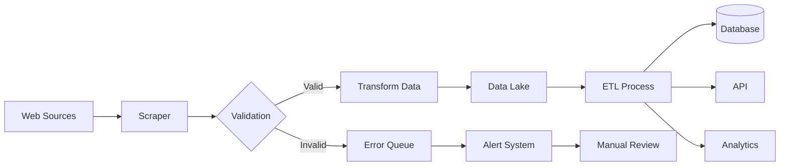
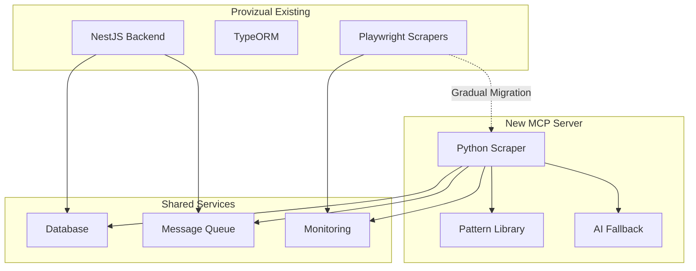

# System Architecture Diagrams

## Overall System Architecture

## Data Flow: Pattern-Based Scraping

## Error Handling Flow

## Pattern Adaptation Workflow

## Integration Options

## Data Pipeline

## Provizual Integration

